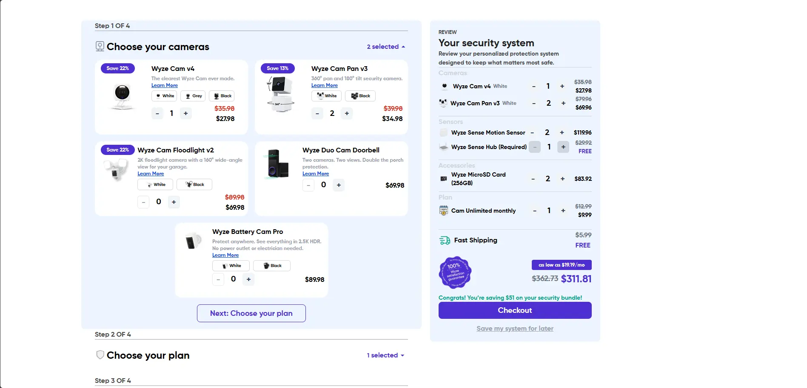
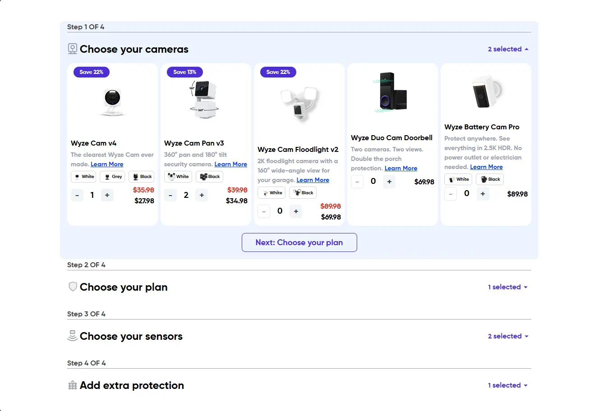
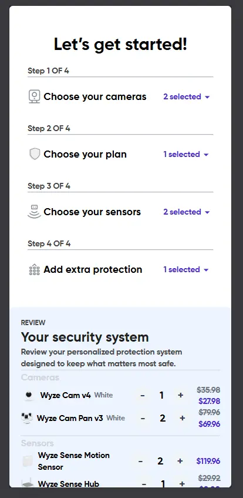

## Bundle Builder

> A single React page application allows users to build a custom security system by selecting cameras, plans, sensors, and storage

---

## Preview

---

## overview
A security-system bundle builder (cameras, sensors, accessories), Users can pick items through a 4-step accordion while a live review panel tracks selections, per-variant and quantities , also they can save their system for later

## Features

- A 4-step accordion builder (1-Cameras 2-Plan 3-Sensors 4-storage)
- A local json file provide a static data for products and steps data of accordion
- Each product has variants and each variant has quantity
- The review panel keep track the states of bundle (quantity and variants)
- Use LocalStorage to save user's system
- Design is responsiv for desktop, tablet and mobile phone

---

## Screenshots

### Desktop

### Tablet

### Mobile

    

---
## how to install

- clone the repo : https://github.com/Abdul-Rahman-Rafat/Bundle-Builder.git
- cd Bundle-Builder
- npm install
- npm run dev

## Tech Stack
- React & Context API
- Tailwind CSS v4
- JSON
  
## Project Structure

    src/
        components/
            builder/
                Builder.jsx
                Step.jsx
                StepHeader.jsx
                ProdcutCard.jsx
                VariantSelector.jsx
                Quantity.jsx
    
            review/
                ReviewPanel.jsx
                ReviewHeader.jsx
                CategoryItems.jsx
                ReviewItem.jsx
                Summery.jsx
                CheckoutButton.jsx
                SaveForLaterLink.jsx
    
        context/
            CartContext.jsx   
            ProductsContext.jsx 
            StepsContext.jsx    
    
    
        data/
            products.json
            steps.json
        pages/
            BundleBuilder.jsx
        app.jsx
        main.jsx
